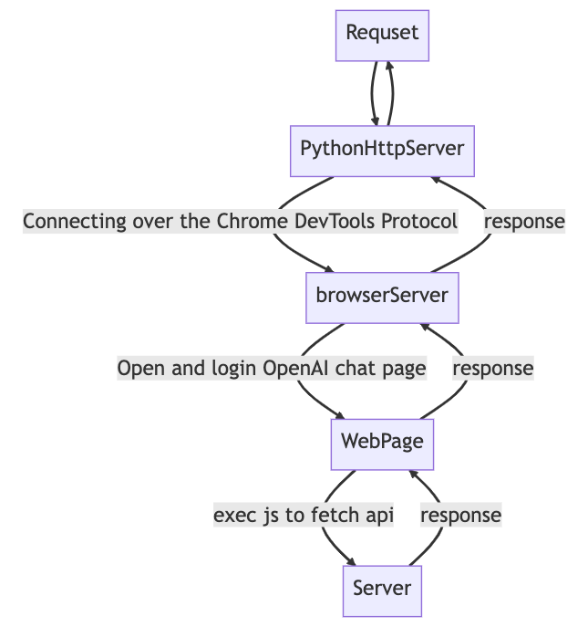

# Chatgpt reverse proxy based on Browser

- [Chatgpt reverse proxy based on Browser](#chatgpt-reverse-proxy-based-on-browser)
  - [Features and TODO](#features-and-todo)
  - [Overview](#overview)
  - [requirements](#requirements)
  - [RUN in docker](#run-in-docker)
  - [RUN locally](#run-locally)
  - [reference](#reference)

## Features and TODO

- [x] support all `backen-api`
- [x] support login and auto get `ACCESS_TOKEN`
- [x] support manually get `ACCESS_TOKEN`
- [x] support use `ACCESS_TOKEN`
- [x] support proxy
- [x] base on browser
- [x] Auto Click cloudflare checkbox
- [x] auto refersh access_token when 403
- [x] support arm64,amd64
- [x] support wgcf
- [ ] vnc password
- [ ] auto login

## Overview



## requirements

- network access to openai
- openai account
- 500M Memory, you can enable swap on you server

## RUN in docker

Options:

1. set `auto_refersh_access_token=True`. Open `localhost:7900`, your can forward port 7900 to local by ssh, and login to `https://chat.openai.com/`, if you get 403 when run sometimes. please `localhost:7900` and check again. **Make sure the first tab of the browser is `https://chat.openai.com/`**
2. set `ACCESS_TOKEN` in your requset header's `Authorization`

```bash
ssh -L 7900:localhost:7900  azure_vm
```

UI use [chatgpt-web-share](https://github.com/moeakwak/chatgpt-web-share/wiki/%E4%B8%AD%E6%96%87%E6%8C%87%E5%8D%97)

change `config.yaml`

```yaml
# from
chatgpt_base_url: http://127.0.0.1:6060/api/
# to
chatgpt_base_url: http://chatgpt-reverse-proxy:8000/backend-api/
```

```yaml
version: "3"

services:
  chatgpt-share:
    image: ghcr.io/moeakwak/chatgpt-web-share:latest
    container_name: chatgpt-web-share
    restart: always
    ports:
      - 80:80
      - 8080:80
      # - 6060:6060
    depends_on:
      chatgpt-reverse-proxy:
        condition: service_healthy
    volumes:
      - ./data:/data
      - ./config.yaml:/app/backend/api/config/config.yaml
      - ./logs:/app/logs

  chatgpt-reverse-proxy:
    image: ghcr.io/dreamhunter2333/chatgpt_reverse_proxy:latest
    # if you use arm64
    # image: ghcr.io/dreamhunter2333/chatgpt_reverse_proxy:arm64
    container_name: chatgpt-reverse-proxy
    restart: always
    ports:
      - "8000:8000"
      - "7900:7900"
    # if use auto_refersh_access_token please mount tmp
    # volumes:
    #   - ./tmp:/app/tmp
    # if you ip is access denied, you can uncomment this to use wgcf
    # network_mode: "service:wgcf"
    environment:
      - VNC_NO_PASSWORD=1
      - user_data_dir=/app/tmp
      # - timeout=100000
      # - navigation_timeout=100000
      # - proxy=http://127.0.0.1:7890
      # - auto_refersh_access_token=False
    healthcheck:
      test:
        [
          "CMD-SHELL",
          "curl --fail http://localhost:8000/health_check || exit 1"
        ]
      interval: 30s
      timeout: 10s
      retries: 10

  # if you ip is access denied, you can uncomment this to use wgcf
  # wgcf:
  #   image: neilpang/wgcf-docker:latest
  #   volumes:
  #     - ./wgcf:/wgcf
  #     - /lib/modules:/lib/modules
  #   privileged: true
  #   sysctls:
  #     net.ipv6.conf.all.disable_ipv6: 0
  #   cap_add:
  #     - NET_ADMIN
  #   command: "-4"
```

## RUN locally

```bash
python3 -m venv ./venv
./venv/bin/python -m pip install -r requirements.txt
./venv/bin/playwright install
./venv/bin/python server.py
./venv/bin/python main.py
```

build docker image

```bash
docker compose buid
docker compose push
docker buildx build --platform linux/amd64 . --file Dockerfile --tag ghcr.io/dreamhunter2333/chatgpt_reverse_proxy:latest --push
docker buildx build --platform linux/arm64 . --file Dockerfile --tag ghcr.io/dreamhunter2333/chatgpt_reverse_proxy:arm64 --push
```

## reference

- [moeakwak/chatgpt-web-share](https://github.com/moeakwak/chatgpt-web-share/wiki/%E4%B8%AD%E6%96%87%E6%8C%87%E5%8D%97)
- [SeleniumHQ/docker-selenium](https://github.com/SeleniumHQ/docker-selenium)
- [microsoft/playwright-python](https://github.com/microsoft/playwright-python)
